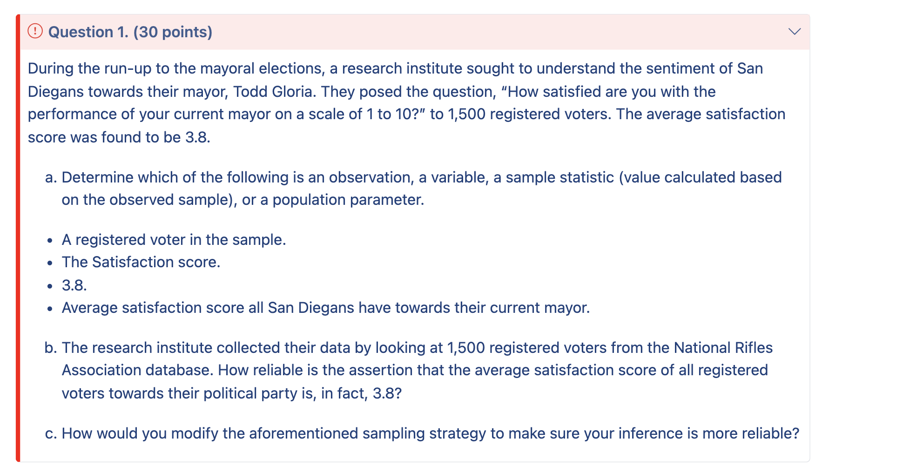

# HW_1 Ruiping Fang

## Question 1

- a.

  - A registered voter in the sample. (**observation**)

  - The Satisfaction score.(**variable**)

  - 3.8.(**sample statistic**)

  - Average satisfaction score all San Diegans have towards their current mayor.(**population parameter**)

- b.

  We run into the risk of picking a biased sample because the number of voters are too small that might not reflect everyone's opinion. Additionally, we don't know if the data are convenience sample, where individuals who are easily accessible are more likely to be included in their database.People live neary the place might have more chance to be selected in to de database.

- c.

  One of the way to avoide biase is to increase different form of questionnaire, via online link,distribute flyers randomly in different places,in this case each case in the population has an equal chance of being included and there is no implied connection between the cases in the sample.
