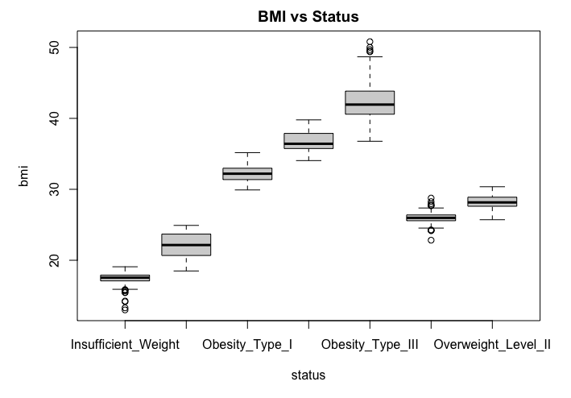

### Question 2


- a. row 2111 col 17
- b.

  - gender : categorical, nominal
  - age : numerical, continuous
  - height : numerical, continuous
  - weight : numerical, continuous
  - family_overweight : categorical, nominal
  - high_caloric_food : categorical, nominal
  - eat_vegetables : categorical, nominal
  - main_meals_daily : categorical, nominal
  - food_between_meals : categorical, nominal
  - smoke : categorical, nominal
  - water_intake_daily : categorical, nominal
  - monitor_calories : categorical, nominal
  - physical_activity_frequency : numerical, continuous
  - tech_device_usage : numerical, continuous
  - alcohol_frequency : categorical, nominal
  - transportation : categorical, nominal
  - status : categorical

- c. 
  

- d.

```R
boxplot(bmi ~ status, data=data, main="BMI vs Status")
```



- e.


```R
get_physical_transport <- function(transportation) {
  return(transportation == "Walking" | transportation == "Bike")
}
data$physical_transport <- get_physical_transport(data$transportation)

true_count = sum(data$physical_transport)

# create a data frame
pie_data <- data.frame(Count = c(true_count, false_count))
row.names(pie_data) <- c("TRUE", "FALSE")

pie(pie_data$Count, labels = row.names(pie_data), main = "physical transport")
```

- f.

```R
boxplot(bmi ~ status, data=data, main="BMI vs Status")
```


