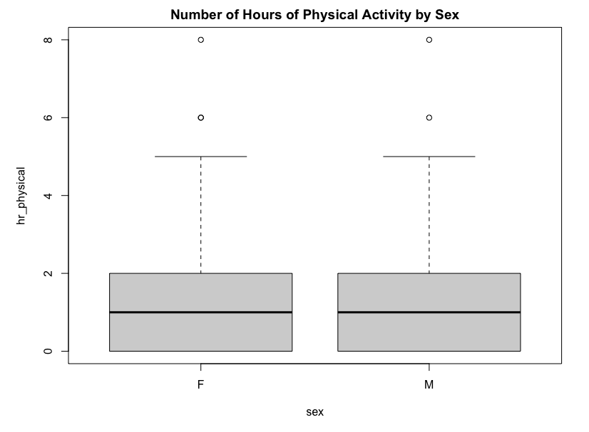
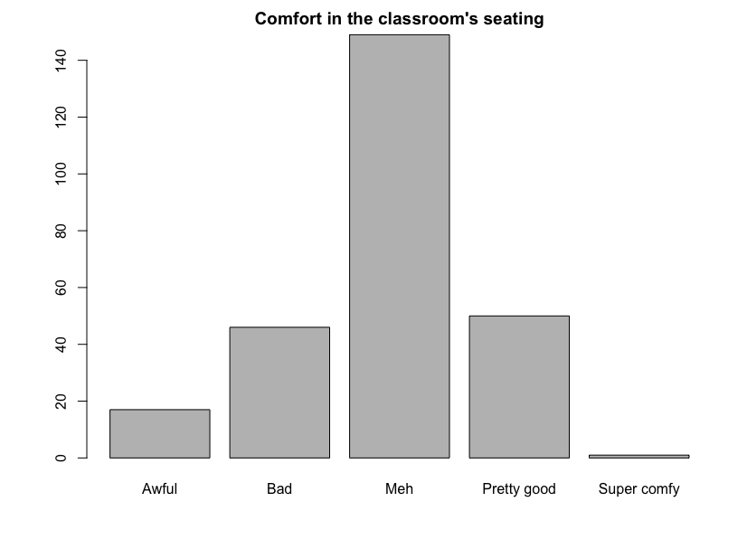
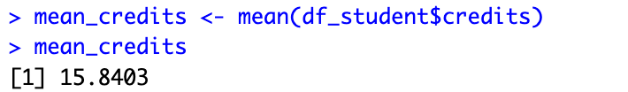
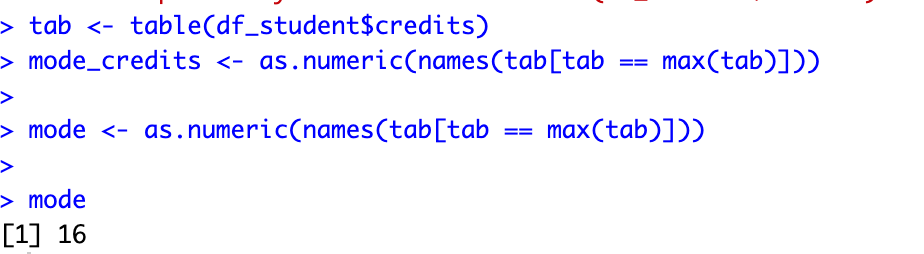

## Question 3

- a.
  Row: 263, Col: 10

- b.

  - favorite_color: categorical,nominal
  - excitement : categorical
  - seat_comfort : categorical, ordinal
  - ucsd_year : numerical, discrete
  - ucsd_major : categorical,nominal
  - credits : numerical, discrete
  - hr_physical : numerical, continuous
  - hr_online : numerical, continuous
  - hr_reading : numerical, continuous
  - sex : categorical, nominal

- c.
  

  There's no differnece bewteen female and male

- d.
  I am pretty confident that it reflects the reality, because the hours of physical activity are not related to sex

- e.

- f.
  

- g
  

- h. A histogram for the number of hours people in spend online

The right tail of the histogram is longer which means it's a right-skewed distribution. In this case, there are few students spend very little time online, while the most of students spend lots of time online.

- i.

The mean is **15.8**

The median is 16

The mode is 16

- j.
  There are 139 students major in Engineering. The fraction is 0.528, which is 53% of the class.
