# HW_1 Ruiping Fang

## Question 1

- During the run-up to the mayoral elections, a research institute sought to understand the sentiment of San Diegans towards their mayor, Todd Gloria. They posed the question, “How satisfied are you with the performance of your current mayor on a scale of 1 to 10?” to 1,500 registered voters. The average satisfaction score was found to be 3.8.

- a. Determine which of the following is an observation, a variable, a sample statistic (value calculated based on the observed sample), or a population parameter.

  - A registered voter in the sample. (**population parameter**)

  - The Satisfaction score.(**variable**)

  - 3.8.(**sample statistic**)

  - Average satisfaction score all San Diegans have towards their current mayor.(**observation**)

- The research institute collected their data by looking at 1,500 registered voters from the National Rifles Association database. How reliable is the assertion that the average satisfaction score of all registered voters towards their political party is, in fact, 3.8?

  we run the risk of picking a biased sample because the number of voters are too small that might not reflect everyone's opinion. Additionally, we don't know if the data are convenience sample, where individuals who are easily accessible are more likely to be included in their database.

- How would you modify the aforementioned sampling strategy to make sure your inference is more reliable?
  //each case in the population has an equal
  chance of being included and there is no implied connection between the cases in the sample.

### Question 2

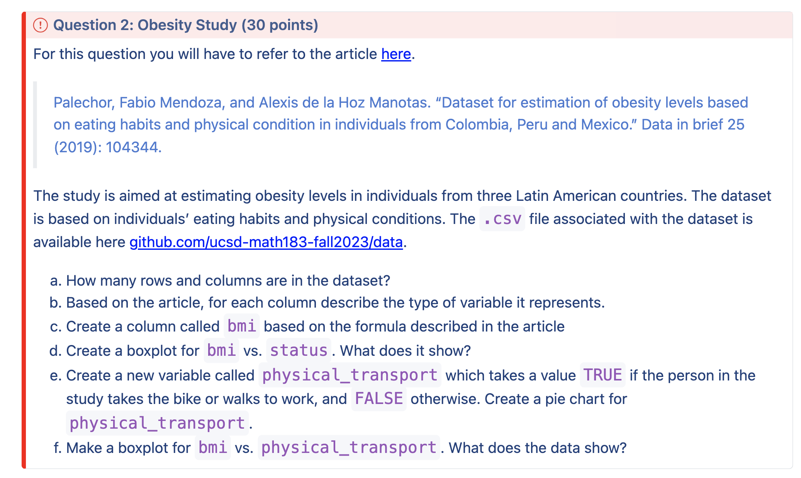

- a. row 2111 col 17
- b.

  - gender : categorical
  - age : numerical, discrete
  - height : numerical, continuous
  - weight : numerical, continuous
  - family_overweight : categorical
  - high_caloric_food : categorical
  - eat_vegetables : numerical, discrete
  - main_meals_daily : numerical, discrete
  - food_between_meals : categorical
  - smoke : categorical
  - water_intake_daily : numerical, discrete
  - monitor_calories : categorical
  - physical_activity_frequency : numerical, discrete
  - tech_device_usage : numerical, discrete
  - alcohol_frequency : categorical
  - transportation : categorical
  - status : categorical

- c. 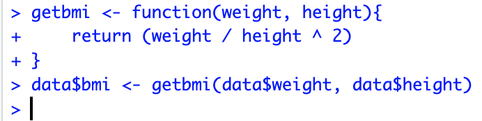
  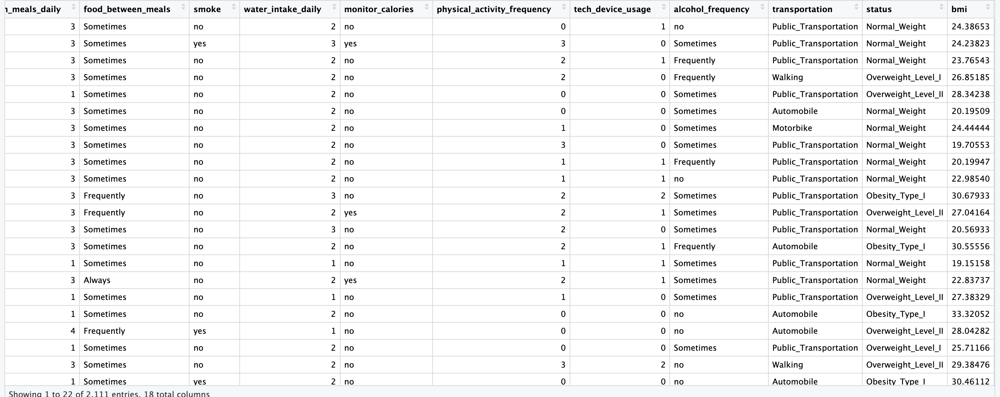

- d.

```R
boxplot(bmi ~ status, data=data, main="BMI vs Status")
```

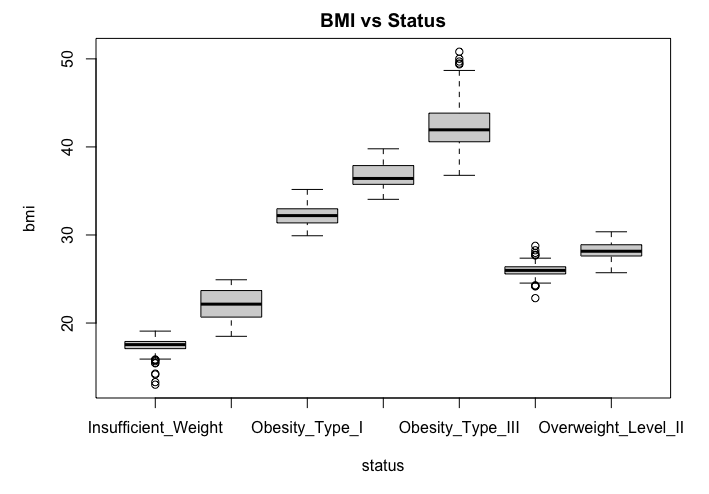

- e.

```R
get_physical_transport <- function(transportation) {
  return(transportation == "Walking" | transportation == "Bike")
}
data$physical_transport <- get_physical_transport(data$transportation)

true_count = sum(data$physical_transport)

# create a data frame
pie_data <- data.frame(Count = c(true_count, false_count))
row.names(pie_data) <- c("TRUE", "FALSE")

pie(pie_data$Count, labels = row.names(pie_data), main = "physical transport")
```

- f.

```R
boxplot(bmi ~ status, data=data, main="BMI vs Status")
```

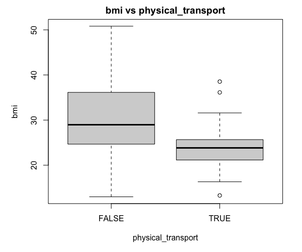

## Question 3


- a.
  Row: 263, Col: 10

- b.

  - favorite_color: categorical
  - excitement : categorical
  - seat_comfort : categorical
  - ucsd_year : numerical, discrete
  - ucsd_major : categorical
  - credits : numerical, discrete
  - hr_physical : numerical, continuous
  - hr_online : numerical, continuous
  - hr_reading : numerical, discrete
  - sex : categorical

- c.
  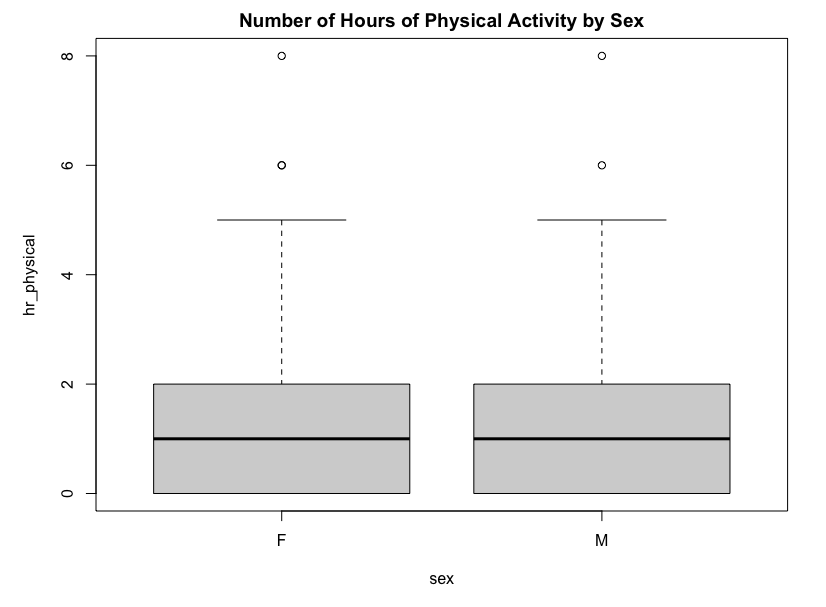

  There's no differnece bewteen female and male

- d.
  I am pretty confident that it reflects the reality, because the hours of physical activity are not related to sex

- e.

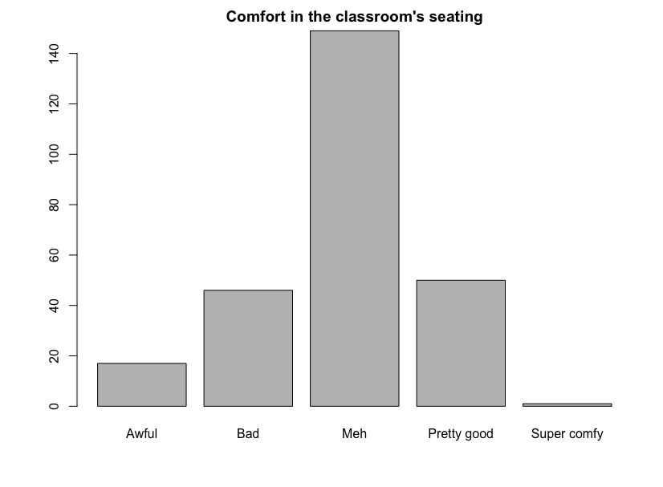

- f.
  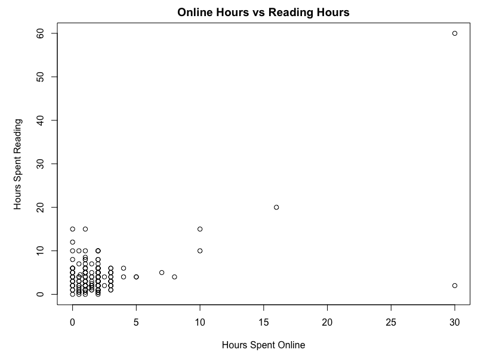

- g
  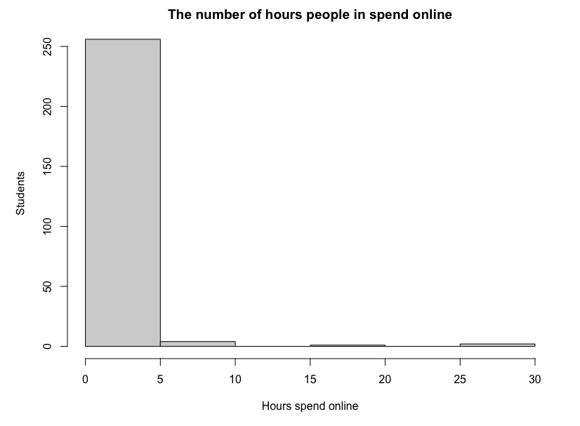

- h. A histogram for the number of hours people in spend online

The left tail of the histogram is longer which means it's a left_skewed distribution. In this case, there are few students spend very little time online, while the most of students spend lots of time online.

- i.

The mean is **15.8**

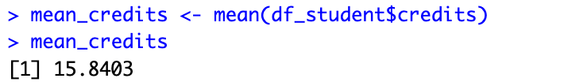

The median is 16

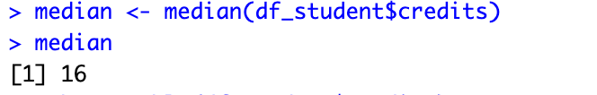

The mode is 16
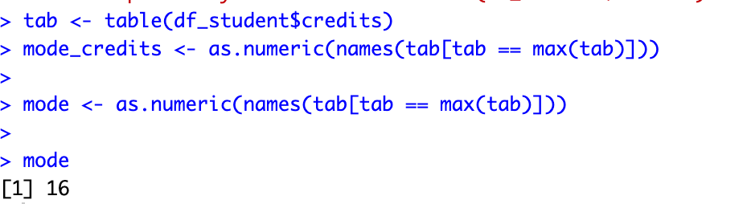
